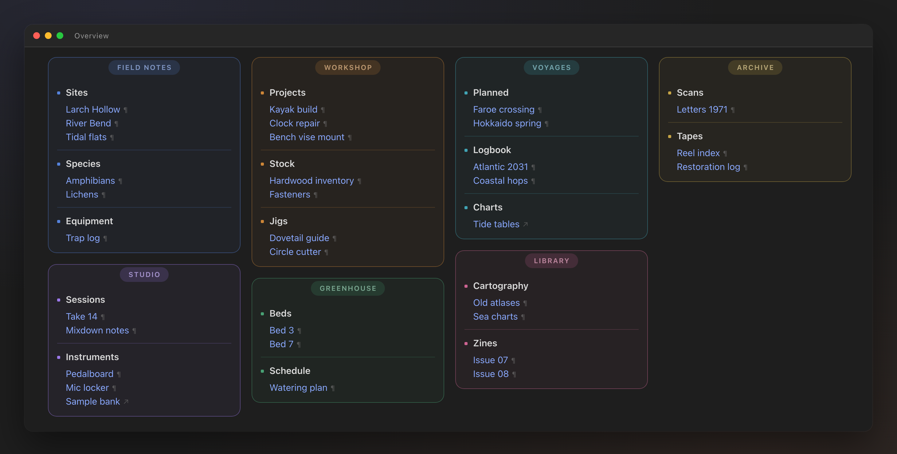
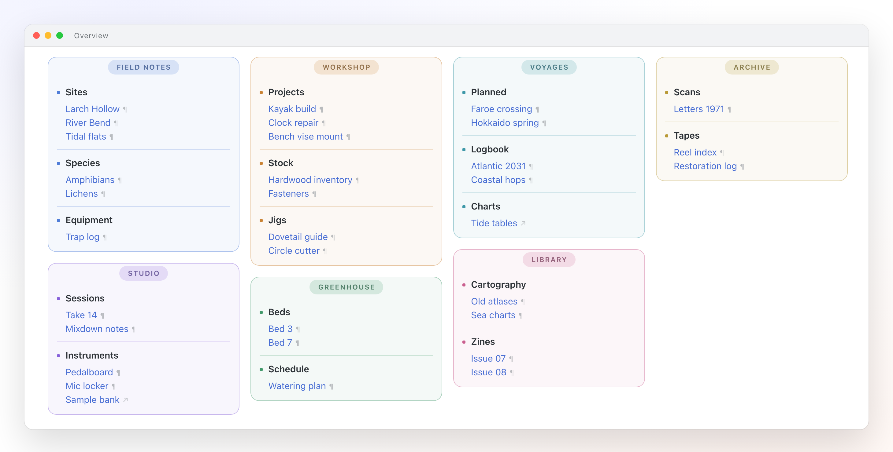

<div align="center">

# obsidian-dashboard

**A dense, masonry-style dashboard layout for Obsidian — built from plain headings and bullet lists.**

No plugins. No Dataview. No HTML in your notes.
One CSS snippet turns an ordinary Markdown outline into a colour-coded control panel.



</div>

---

## Why

Most Obsidian dashboards are built one of two ways: a wall of nested bullets that wastes 70% of the
window, or a plugin-driven grid that locks your content into a query language. `dashboard` takes a
third route — it reads a **plain Markdown outline** and lays it out as a flowing masonry of cards.

Your note stays portable. Delete the snippet and you still have a perfectly readable list.

```markdown
---
cssclasses:
  - dashboard
---
## Workshop
- **Projects**
	- [[Kayak build]]
	- [[Clock repair]]
- **Stock**
	- [[Hardwood inventory]]
```

`## Heading` becomes a **section** — a bordered card with a pill-shaped title.
Each top-level bullet becomes a **block** inside it. Nested bullets are the links.

---

## Features

|  | |
|---|---|
| **Masonry flow** | Sections stream through a multi-column layout instead of stacking in rigid rows. A short section slides up beside a tall one, so there are no dead zones on the right. |
| **Colour-coded sections** | Each section gets its own hue, applied to the border, surface, hover state and title pill from a single variable. |
| **Zero-chrome reading view** | The inline title and properties block are hidden in Reading view only — the editor keeps them, so frontmatter stays editable. |
| **Typed links** | Internal notes are marked `¶`, external URLs `↗`. Underlines are removed. Unresolved links turn the marker red. |
| **No bullet noise** | List markers are suppressed at every level; a small square in the section colour marks each block instead. |
| **Seamless borders** | The whole section outline is drawn by a single element — no sub-pixel gaps where a header meets its body (see [How it works](#how-it-works)). |

---

## Preview

<table>
<tr>
<td width="50%"></td>
<td width="50%"></td>
</tr>
<tr>
<td align="center"><b>Dark</b></td>
<td align="center"><b>Light</b></td>
</tr>
</table>

All colours derive from your theme's variables, so the snippet follows whatever theme and accent
colour you already use.

---

## Install

1. Copy [`dashboard.css`](dashboard.css) into `YourVault/.obsidian/snippets/`
2. Enable it in **Settings → Appearance → CSS snippets**
3. Add the class to any note's frontmatter:

```yaml
---
cssclasses:
  - dashboard
---
```

4. Open the note in **Reading view** (`Cmd/Ctrl + E`)

> [!IMPORTANT]
> The layout only applies in Reading view. Set **Settings → Editor → Default view for new tabs**
> to *Reading view*, or pin the note, so it always opens laid out.

---

## Writing the note

The structure is deliberately boring — three levels, nothing else:

```markdown
## Section title          ← a bordered card, title rendered as a pill
- **Block title**         ← a group inside the card
	- [[A note]]          ← content, indented with a Tab
	- [External link](https://example.com)
	- [[One]] · [[Two]]   ← use · to put short links on one line
```

Two rules worth knowing:

- **Indent with tabs, not spaces.** Obsidian's default is tabs; spaces produce a different DOM and
  the nesting styles will not match.
- **Section order controls packing.** Sections flow in document order and are never split across
  columns, so a tall section followed by another tall one can leave a gap. Put short sections next to
  each other and the columns fill evenly.

---

## Customisation

Everything tunable lives in one block at the top of the file.

| Variable | Default | What it does |
|---|---|---|
| `--dash-head` | `34px` | Height of the section title strip. Must be a whole number of pixels. |
| `--dash-accent` | `var(--text-accent)` | Base section colour, overridden per section below. |
| `--dash-marker` | `5px` | Size of the square marker before a block title. |
| `--dash-marker-gap` | `9px` | Gap between marker and title. Block content is indented by marker + gap. |
| `--dash-line` | 38% of accent | Section border. |
| `--dash-line-soft` | 20% of accent | Divider between blocks. |
| `--dash-surface` | 5% of accent | Section fill. |
| `--dash-chip` | 16% of accent | Title pill background. |
| `column-width` | `270px` | Minimum column width; the column count adapts to the window. |

### Section colours

Colours are assigned by position. A section is two sibling elements — the heading and the list —
so they are addressed in pairs:

```css
.dashboard .markdown-preview-section > div:nth-of-type(2),
.dashboard .markdown-preview-section > div:nth-of-type(3) {
	--dash-accent: var(--color-blue);
}
```

Seven pairs ship by default (blue, purple, orange, green, cyan, pink, yellow). Add more by
continuing the sequence — `(16), (17)`, `(18), (19)` and so on. A section with no matching rule
falls back to the theme accent, so nothing breaks if you run out.

**Want it monochrome?** Delete those rules and set `--dash-accent: var(--text-muted)` once.

---

## How it works

Three problems had to be solved to make plain Markdown behave like a dashboard. Each has a comment
in the source explaining it — the summary:

**Masonry from headings.** The whole preview is one CSS multi-column context. Sections are kept
whole with `break-inside: avoid`, and a heading is glued to its list with `break-after: avoid` on
the element that contains it. The browser balances the columns, so vertical space fills itself.

**A section outline with no seams.** A heading and its list are two sibling `<div>`s — you cannot
wrap them. Drawing the top half of a border on one and the bottom half on the other looks correct in
theory, but browsers round each box independently and a hairline gap appears where they meet. The
fix: the list element draws the *entire* outline, pulled up over the heading with
`margin-top: calc(-1 * var(--dash-head))` and pushed back with an equal `padding-top`. One element,
one border, no seam.

**Alignment that survives edits.** The block title is offset by its marker, so the nested links are
indented by `calc(var(--dash-marker) + var(--dash-marker-gap))` — the same numbers. Resize the
marker and the alignment follows automatically.

---

## Requirements

- **Obsidian 1.4+** — needs `:has()` support in the bundled Electron
- **Chromium 111+** for `color-mix()` (Obsidian 1.5+ ships this)

Tested with the [Border](https://github.com/Akifyss/obsidian-border) theme; the snippet neutralises
that theme's coloured heading indicator and red bold text inside dashboards only.

---

## Regenerating the previews

The screenshots are rendered from [`preview/preview.html`](preview/preview.html), which reproduces
Obsidian's Reading-view DOM with fictional data — no vault contents are exposed.

```bash
CHROME="/Applications/Google Chrome.app/Contents/MacOS/Google Chrome"

"$CHROME" --headless --disable-gpu --hide-scrollbars \
  --force-device-scale-factor=2 --window-size=1460,740 \
  --screenshot=preview/dashboard-dark.png \
  "file://$PWD/preview/preview.html"

"$CHROME" --headless --disable-gpu --hide-scrollbars \
  --force-device-scale-factor=2 --window-size=1460,740 \
  --screenshot=preview/dashboard-light.png \
  "file://$PWD/preview/preview.html#light"
```

---

## License

[MIT](LICENSE)
